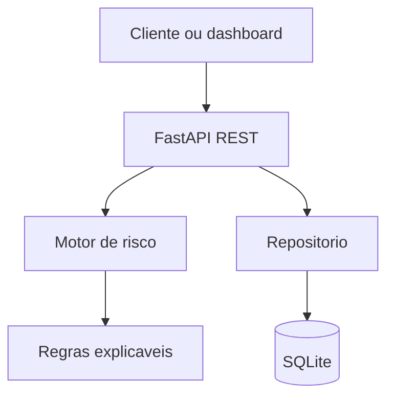

# VigiaGraph

Plataforma explicavel de deteccao de fraudes em transacoes financeiras. O projeto analisa
comportamentos suspeitos, calcula um score de risco e mostra exatamente quais sinais levaram
a decisao — porque escrever apenas "a IA decidiu" seria uma bela forma de irritar qualquer
analista de fraude.

> **Status:** MVP funcional (`v0.1.0`). Utiliza dados sinteticos e nao deve ser usado para
> decisoes financeiras reais.

## Demonstracao

O dashboard acompanha transacoes analisadas, casos sinalizados, score medio e regras acionadas.
Depois de iniciar a aplicacao, abra `http://localhost:8000/dashboard` e use **Gerar dados de
demonstracao**.

## Funcionalidades atuais

- API REST com FastAPI e documentacao OpenAPI automatica;
- motor de risco deterministico e explicavel;
- sete sinais antifraude, cada um com peso e evidencia;
- gerador reprodutivel de transacoes sinteticas;
- persistencia local com SQLite;
- dashboard responsivo sem etapa de build no frontend;
- testes unitarios e de integracao;
- Docker, Docker Compose e pipeline de CI.

### Regras implementadas

| Regra | O que detecta | Peso |
| --- | --- | ---: |
| `HIGH_AMOUNT` | valor acima do limite configurado | 25 |
| `ODD_HOURS` | compra entre 00h e 05h UTC | 10 |
| `RAPID_SUCCESSION` | varias compras do mesmo cartao em poucos minutos | 35 |
| `SHARED_DEVICE` | dispositivo utilizado por usuarios diferentes | 30 |
| `SHARED_IP` | IP associado a tres ou mais outros cartoes | 25 |
| `AMOUNT_ANOMALY` | valor muito superior a media historica do cartao | 25 |
| `COUNTRY_CHANGE` | pais diferente do padrao recente do usuario | 15 |

## Arquitetura



O dominio nao depende do FastAPI nem do banco. Isso permite substituir SQLite por PostgreSQL,
adicionar Neo4j e incorporar modelos de machine learning sem reescrever as regras existentes.

## Como executar

### Ambiente local

Requisitos: Python 3.11 ou superior.

```bash
git clone https://github.com/SEU-USUARIO/vigiagraph.git
cd vigiagraph
python -m venv .venv
```

No Windows PowerShell:

```powershell
.venv\Scripts\Activate.ps1
python -m pip install -e ".[dev]"
uvicorn app.main:app --reload
```

No Linux ou macOS:

```bash
source .venv/bin/activate
python -m pip install -e ".[dev]"
uvicorn app.main:app --reload
```

Acesse:

- Dashboard: `http://localhost:8000/dashboard`
- Swagger: `http://localhost:8000/docs`
- Health check: `http://localhost:8000/api/v1/health`

### Docker

```bash
docker compose up --build
```

## Exemplo de requisicao

```bash
curl -X POST http://localhost:8000/api/v1/transactions/analyze \
  -H "Content-Type: application/json" \
  -d '{
    "user_id": "user-001",
    "card_id": "card-001",
    "device_id": "device-001",
    "ip_address": "192.0.2.1",
    "merchant_id": "merchant-001",
    "amount": 7500,
    "country": "BR"
  }'
```

Resposta resumida:

```json
{
  "transaction_id": "...",
  "score": 25,
  "level": "low",
  "triggered_rules": [
    {
      "code": "HIGH_AMOUNT",
      "description": "Valor acima do limite configurado.",
      "weight": 25,
      "evidence": { "amount": 7500, "threshold": 5000 }
    }
  ]
}
```

## Testes e qualidade

```bash
pytest
ruff check .
```

O mesmo processo roda automaticamente a cada push e pull request pelo GitHub Actions.

Para planejar as proximas entregas como issues e milestones, consulte
[`docs/BACKLOG.md`](docs/BACKLOG.md).

## Roadmap

- [x] API, regras explicaveis e dashboard inicial;
- [x] dados sinteticos, testes, Docker e CI;
- [ ] PostgreSQL e migrations com Alembic;
- [ ] modelagem de usuarios, cartoes, IPs e dispositivos no Neo4j;
- [ ] score por conexoes suspeitas usando Cypher;
- [ ] deteccao de anomalias com Isolation Forest;
- [ ] avaliacao de modelos com precision, recall, F1 e matriz de confusao;
- [ ] fila de eventos com Redis e Celery;
- [ ] autenticacao e perfis de analista/administrador;
- [ ] gestao de casos e feedback do analista;
- [ ] deploy em nuvem e observabilidade.

## Estrutura do repositorio

```text
vigiagraph/
├── .github/workflows/ci.yml
├── app/
│   ├── api/routes.py
│   ├── domain/models.py
│   ├── infrastructure/repository.py
│   ├── services/
│   │   ├── demo_generator.py
│   │   └── risk_engine.py
│   ├── web/index.html
│   └── main.py
├── scripts/seed_demo.py
├── tests/
├── Dockerfile
├── docker-compose.yml
└── pyproject.toml
```

## Etica e limitacoes

Este repositorio e educacional. Dados reais de pagamento nao devem ser enviados ao projeto.
As regras podem produzir falsos positivos e o score nao substitui investigacao humana. Futuras
versoes devem avaliar vies, privacidade, explicabilidade e protecao de dados conforme a LGPD.

## Licenca

Distribuido sob a licenca MIT. Consulte [LICENSE](LICENSE).
